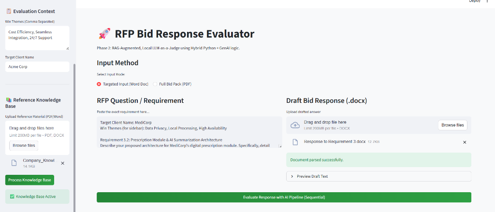
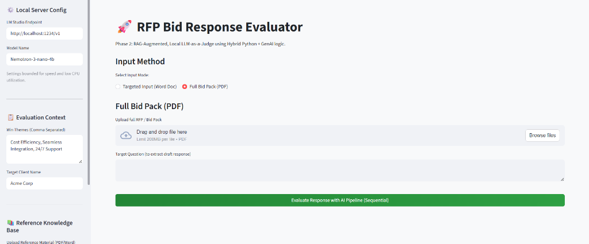
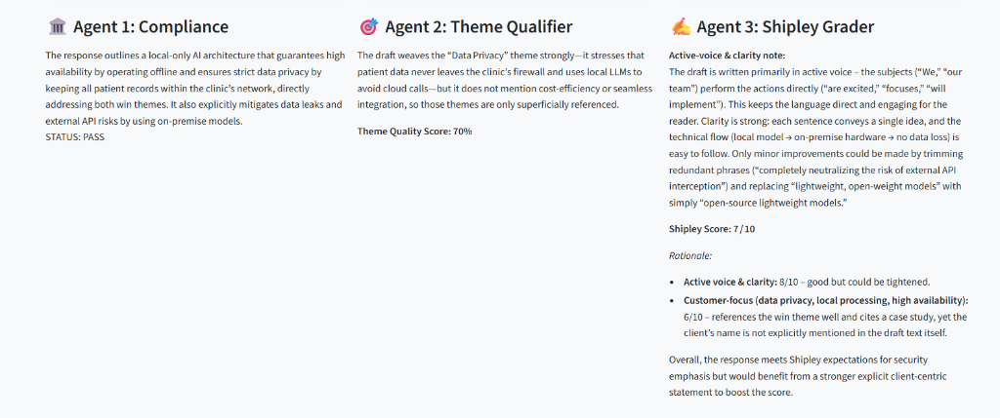

# RFP Bid Response Evaluator (Phase 2)

RFP Bid Response Evaluator is a Streamlit-based web application that utilizes a local Large Language Model (LLM) to evaluate draft bid responses against Request for Proposal (RFP) requirements, win themes, and Shipley best practices. 

With the **Phase 2** upgrade, the application now supports direct document parsing (PDF and DOCX) and features a dynamic **Retrieval-Augmented Generation (RAG)** pipeline to inject relevant knowledge directly into the AI evaluation.

## 🚀 Key Features

### 1. Document Parsing & UI Modes
The app eliminates manual copy-pasting by introducing two input modes:
* **Targeted Input (Word Doc):** Upload a drafted answer as a `.docx` file along with the RFP requirement.
* **Full Bid Pack (PDF):** Upload an entire RFP/Bid Pack `.pdf` and provide a "Target Question". The system automatically chunks the PDF and uses similarity search to extract the most relevant draft section to evaluate.


*Uploading a targeted .docx response and building the RAG Knowledge Base.*


*Extracting specific responses directly from a Full Bid Pack PDF.*

### 2. Retrieval-Augmented Generation (RAG)
You can upload reference material (like previous winning bids or Shipley guides) into the **Reference Knowledge Base** sidebar.
* The system parses and chunks the documents, embedding them using a lightweight local model (`all-MiniLM-L6-v2`) into a transient **ChromaDB** vector store.
* When evaluating your bid, the system retrieves the top-k most relevant best practices and injects them as context directly into the AI Agent prompts.

### 3. Multi-Agent Evaluation Pipeline
The system relies on a hybrid Python-native heuristic engine and 3 distinct AI Agents:

* **Python Lexical Analysis:** Calculates Win Theme density and Shipley customer-focus metrics (inward vs client mentions).
* **Agent 1 (Compliance):** Determines if the draft response meets ALL functional requirements (Outputs `PASS`, `FAIL`, or `PARTIAL`).
* **Agent 2 (Theme Qualifier):** Evaluates if the Win Themes are effectively woven into the narrative conceptually, augmented by RAG best practices.
* **Agent 3 (Shipley Grader):** Evaluates active voice, clarity, and structural focus, scoring the response out of 10, augmented by RAG best practices.


*The evaluation dashboard displaying Agent scoring and reasoning.*

## ⚙️ Prerequisites

- **Python 3.8+**
- **LM Studio:** You need to have LM Studio installed and running a local server. The app is optimized for smaller reasoning models (e.g., `Nemotron-3-nano-4b`) to ensure low CPU utilization and strict memory management.

## 🛠️ Installation & Setup

1. **Clone the repository:**
   (If you haven't already, clone this directory to your local machine).

2. **Install the dependencies:**
   Open a terminal in the project directory and run:
   ```bash

py -m venv venv
venv\Scripts\activate
venv\Scripts\Activate.ps1(powershell)
pip install -r requirements.txt

   ```
   *Note: Phase 2 introduced new dependencies like `pdfplumber`, `chromadb`, and `langchain-huggingface`.*

3. **Start your Local LLM Server:**
   * Open **LM Studio**.
   * Load your preferred model and start the Local Server. Ensure it is running on `http://localhost:1234/v1`.

4. **Run the Application:**
   In your terminal, within the project directory, run:
   ```bash
   streamlit run app.py
   ```

5. **Using the App:**
   * Adjust the "Local Server Config" if your LM Studio uses a different endpoint.
   * Upload files to the **Reference Knowledge Base** and click "Process Knowledge Base".
   * Select your **Input Mode** and upload your RFP documents.
   * Click **Evaluate Response with AI Pipeline** to trigger the Agents.
